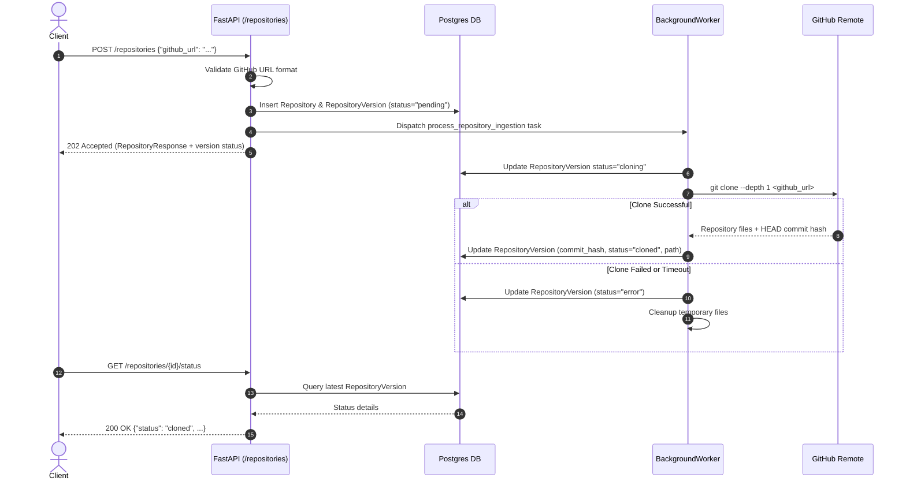

# RepoMind – Phase 3: GitHub Ingestion Service – Cloning & Validation

> **Status:** Ready to implement (Phase 2 ✅ database schema ready)  
> **Goal:** Accept a GitHub URL via API, validate the repository, clone it to temporary/persistent local storage using shallow clone, extract metadata (commit hash, default branch, repo name), update database records, and kick off background ingestion tasks.

---

## Overview

In **Phase 2**, we created the full database schema (`repositories`, `repository_versions`, `code_files`, `code_chunks`, etc.).  
In **Phase 3**, we implement the first operational stage of the RepoMind pipeline: **Ingesting a GitHub repository**.

When a user submits a repository URL:
1. The system validates the URL structure and accessibility.
2. An initial database entry is created in `repositories` and `repository_versions` with `status="pending"`.
3. A FastAPI `BackgroundTask` is triggered to clone the repository to disk asynchronously.
4. Git metadata (latest commit hash, default branch) is extracted.
5. The `repository_versions` record status is updated to `cloned` (ready for Phase 4 file processing).

---

## File Structure After Phase 3

```
repomind/
├── backend/
│   ├── app/
│   │   ├── main.py                  ← include router
│   │   ├── config.py                ← updated with REPO_STORAGE_DIR settings
│   │   ├── api/
│   │   │   ├── __init__.py
│   │   │   └── repositories.py      ← POST /repositories, GET /repositories/{id}
│   │   ├── schemas/
│   │   │   ├── __init__.py
│   │   │   └── repository.py        ← Pydantic request/response models
│   │   ├── services/
│   │   │   ├── __init__.py
│   │   │   └── ingestion.py         ← URL validation, Git cloning, metadata extraction
│   │   └── models/                  ← (existing SQLAlchemy models from Phase 2)
│   └── tests/
│       ├── test_ingestion.py        ← unit tests for cloning service
│       └── test_api_repositories.py ← API endpoint tests
```

---

## Step-by-Step Implementation

### Step 1 – Update Application Configuration

Update `app/config.py` to add settings for repo storage and clone timeouts:

```python
# app/config.py
from pathlib import Path
from pydantic_settings import BaseSettings, SettingsConfigDict

BASE_DIR = Path(__file__).resolve().parents[2]

class Settings(BaseSettings):
    DATABASE_URL: str
    REPO_STORAGE_DIR: Path = BASE_DIR / "storage" / "repos"
    GIT_CLONE_TIMEOUT_SECONDS: int = 300  # 5 minute timeout for cloning
    MAX_REPO_SIZE_MB: int = 500           # soft limit check post-clone

    model_config = SettingsConfigDict(
        env_file=BASE_DIR / ".env",
        env_file_encoding="utf-8",
        extra="ignore"
    )

settings = Settings()
```

---

### Step 2 – Define Pydantic Schemas

Create request and response schemas in `app/schemas/repository.py`:

```python
# app/schemas/repository.py
import re
from datetime import datetime
from uuid import UUID
from pydantic import BaseModel, HttpUrl, field_validator


GITHUB_URL_REGEX = re.compile(
    r"^https://github\.com/(?P<owner>[\w.-]+)/(?P<repo>[\w.-]+)(?:\.git)?$"
)


class RepositoryCreate(BaseModel):
    github_url: str

    @field_validator("github_url")
    @classmethod
    def validate_github_url(cls, v: str) -> str:
        v = v.strip().rstrip("/")
        match = GITHUB_URL_REGEX.match(v)
        if not match:
            raise ValueError(
                "Invalid GitHub URL format. Must be like: https://github.com/owner/repository"
            )
        return v


class RepositoryVersionResponse(BaseModel):
    id: UUID
    repository_id: UUID
    commit_hash: str
    status: str
    cloned_path: str | None = None
    created_at: datetime

    class Config:
        from_attributes = True


class RepositoryResponse(BaseModel):
    id: UUID
    github_url: str
    name: str
    created_at: datetime
    latest_version: RepositoryVersionResponse | None = None

    class Config:
        from_attributes = True


class IngestionStatusResponse(BaseModel):
    repository_id: UUID
    version_id: UUID
    name: str
    status: str  # pending | cloning | cloned | processing | ready | error
    commit_hash: str | None = None
    error_message: str | None = None
```

Create `app/schemas/__init__.py`:
```python
from app.schemas.repository import (
    RepositoryCreate,
    RepositoryResponse,
    RepositoryVersionResponse,
    IngestionStatusResponse,
)

__all__ = [
    "RepositoryCreate",
    "RepositoryResponse",
    "RepositoryVersionResponse",
    "IngestionStatusResponse",
]
```

---

### Step 3 – Implement Ingestion & Cloning Service

Create `app/services/ingestion.py`:

```python
# app/services/ingestion.py
import asyncio
import logging
import os
import shutil
import uuid
from pathlib import Path
import git
from sqlalchemy.ext.asyncio import AsyncSession
from sqlalchemy import select

from app.config import settings
from app.database import AsyncSessionLocal
from app.models.repository import Repository, RepositoryVersion
from app.schemas.repository import GITHUB_URL_REGEX

logger = logging.getLogger(__name__)


def extract_repo_name(github_url: str) -> str:
    """Extract owner/repo name from valid GitHub URL."""
    match = GITHUB_URL_REGEX.match(github_url)
    if match:
        return f"{match.group('owner')}_{match.group('repo')}"
    return github_url.rstrip("/").split("/")[-1].replace(".git", "")


def sync_clone_repo(github_url: str, target_dir: Path) -> tuple[str, str]:
    """
    Synchronous helper function to run git clone (runs in thread pool).
    Performs a shallow clone (--depth 1) for speed and disk efficiency.
    Returns (commit_hash, branch_name).
    """
    if target_dir.exists():
        shutil.rmtree(target_dir, ignore_errors=True)

    target_dir.mkdir(parents=True, exist_ok=True)

    logger.info(f"Cloning {github_url} into {target_dir}...")
    
    # Clone with depth=1 for optimal performance
    repo = git.Repo.clone_from(
        url=github_url,
        to_path=str(target_dir),
        depth=1,
        single_branch=True,
    )

    commit_hash = repo.head.commit.hexsha
    active_branch = repo.active_branch.name if not repo.head.is_detached else "HEAD"
    
    logger.info(f"Successfully cloned {github_url} at commit {commit_hash[:7]}")
    return commit_hash, active_branch


async def process_repository_ingestion(repository_id: uuid.UUID, version_id: uuid.UUID):
    """
    Background worker task executed by FastAPI BackgroundTasks.
    Handles cloning, updating DB status, and error states.
    """
    async with AsyncSessionLocal() as session:
        # Fetch Version record
        result = await session.execute(
            select(RepositoryVersion).where(RepositoryVersion.id == version_id)
        )
        version = result.scalars().first()
        
        result_repo = await session.execute(
            select(Repository).where(Repository.id == repository_id)
        )
        repo_obj = result_repo.scalars().first()

        if not version or not repo_obj:
            logger.error(f"Ingestion failed: Repository/Version record not found ({version_id})")
            return

        # Update status to cloning
        version.status = "cloning"
        await session.commit()

        # Destination path: storage/repos/<repo_id>/<version_id>
        dest_dir = settings.REPO_STORAGE_DIR / str(repository_id) / str(version_id)

        try:
            # Offload synchronous blocking git clone call to asyncio threadpool with timeout
            commit_hash, _ = await asyncio.wait_for(
                asyncio.to_thread(sync_clone_repo, repo_obj.github_url, dest_dir),
                timeout=float(settings.GIT_CLONE_TIMEOUT_SECONDS)
            )

            # Update DB with clone output details
            version.commit_hash = commit_hash
            version.cloned_path = str(dest_dir)
            version.status = "cloned"  # ready for Phase 4 (file processing)
            await session.commit()
            
            logger.info(f"Ingestion step 1 complete for version {version_id}")

        except asyncio.TimeoutError:
            logger.error(f"Clone timed out after {settings.GIT_CLONE_TIMEOUT_SECONDS}s for {repo_obj.github_url}")
            version.status = "error"
            await session.commit()
            if dest_dir.exists():
                shutil.rmtree(dest_dir, ignore_errors=True)

        except Exception as e:
            logger.exception(f"Error cloning repository {repo_obj.github_url}: {e}")
            version.status = "error"
            await session.commit()
            if dest_dir.exists():
                shutil.rmtree(dest_dir, ignore_errors=True)
```

Create `app/services/__init__.py`:
```python
from app.services.ingestion import (
    extract_repo_name,
    sync_clone_repo,
    process_repository_ingestion,
)

__all__ = [
    "extract_repo_name",
    "sync_clone_repo",
    "process_repository_ingestion",
]
```

---

### Step 4 – Create API Router & Endpoints

Create `app/api/repositories.py`:

```python
# app/api/repositories.py
from uuid import UUID
from fastapi import APIRouter, BackgroundTasks, Depends, HTTPException, status
from sqlalchemy import select
from sqlalchemy.ext.asyncio import AsyncSession
from sqlalchemy.orm import selectinload

from app.database import AsyncSessionLocal
from app.models.repository import Repository, RepositoryVersion
from app.schemas.repository import (
    RepositoryCreate,
    RepositoryResponse,
    RepositoryVersionResponse,
    IngestionStatusResponse,
)
from app.services.ingestion import extract_repo_name, process_repository_ingestion

router = APIRouter(prefix="/repositories", tags=["Repositories"])


async def get_db():
    async with AsyncSessionLocal() as session:
        yield session


@router.post(
    "",
    response_model=RepositoryResponse,
    status_code=status.HTTP_202_ACCEPTED,
    summary="Ingest a new GitHub repository",
)
async def create_repository(
    payload: RepositoryCreate,
    background_tasks: BackgroundTasks,
    db: AsyncSession = Depends(get_db),
):
    """
    Accepts a public GitHub URL, creates repository records, 
    and triggers background cloning process.
    """
    # 1. Check if repository already exists
    stmt = select(Repository).where(Repository.github_url == payload.github_url)
    res = await db.execute(stmt)
    existing_repo = res.scalars().first()

    repo_name = extract_repo_name(payload.github_url)

    if existing_repo:
        repo = existing_repo
    else:
        repo = Repository(
            github_url=payload.github_url,
            name=repo_name,
        )
        db.add(repo)
        await db.flush()

    # 2. Create new version record in pending state
    version = RepositoryVersion(
        repository_id=repo.id,
        commit_hash="pending",  # Will be updated after clone
        status="pending",
    )
    db.add(version)
    await db.commit()
    await db.refresh(repo)
    await db.refresh(version)

    # 3. Enqueue asynchronous cloning in background task
    background_tasks.add_task(
        process_repository_ingestion,
        repository_id=repo.id,
        version_id=version.id,
    )

    return RepositoryResponse(
        id=repo.id,
        github_url=repo.github_url,
        name=repo.name,
        created_at=repo.created_at,
        latest_version=RepositoryVersionResponse.model_validate(version),
    )


@router.get(
    "",
    response_model=list[RepositoryResponse],
    summary="List all ingested repositories",
)
async def list_repositories(db: AsyncSession = Depends(get_db)):
    stmt = select(Repository).options(selectinload(Repository.versions))
    res = await db.execute(stmt)
    repos = res.scalars().all()
    
    response = []
    for r in repos:
        latest = sorted(r.versions, key=lambda v: v.created_at, reverse=True)[0] if r.versions else None
        response.append(
            RepositoryResponse(
                id=r.id,
                github_url=r.github_url,
                name=r.name,
                created_at=r.created_at,
                latest_version=RepositoryVersionResponse.model_validate(latest) if latest else None,
            )
        )
    return response


@router.get(
    "/{repository_id}",
    response_model=RepositoryResponse,
    summary="Get repository details by ID",
)
async def get_repository(repository_id: UUID, db: AsyncSession = Depends(get_db)):
    stmt = (
        select(Repository)
        .where(Repository.id == repository_id)
        .options(selectinload(Repository.versions))
    )
    res = await db.execute(stmt)
    repo = res.scalars().first()

    if not repo:
        raise HTTPException(
            status_code=status.HTTP_404_NOT_FOUND,
            detail=f"Repository {repository_id} not found",
        )

    latest = sorted(repo.versions, key=lambda v: v.created_at, reverse=True)[0] if repo.versions else None
    return RepositoryResponse(
        id=repo.id,
        github_url=repo.github_url,
        name=repo.name,
        created_at=repo.created_at,
        latest_version=RepositoryVersionResponse.model_validate(latest) if latest else None,
    )


@router.get(
    "/{repository_id}/status",
    response_model=IngestionStatusResponse,
    summary="Check ingestion status of repository",
)
async def get_ingestion_status(repository_id: UUID, db: AsyncSession = Depends(get_db)):
    stmt = (
        select(Repository)
        .where(Repository.id == repository_id)
        .options(selectinload(Repository.versions))
    )
    res = await db.execute(stmt)
    repo = res.scalars().first()

    if not repo:
        raise HTTPException(
            status_code=status.HTTP_404_NOT_FOUND,
            detail=f"Repository {repository_id} not found",
        )

    if not repo.versions:
        raise HTTPException(
            status_code=status.HTTP_404_NOT_FOUND,
            detail="No version records found for repository",
        )

    latest_version = sorted(repo.versions, key=lambda v: v.created_at, reverse=True)[0]

    return IngestionStatusResponse(
        repository_id=repo.id,
        version_id=latest_version.id,
        name=repo.name,
        status=latest_version.status,
        commit_hash=latest_version.commit_hash if latest_version.commit_hash != "pending" else None,
    )
```

Create `app/api/__init__.py`:
```python
from app.api.repositories import router as repositories_router

__all__ = ["repositories_router"]
```

---

### Step 5 – Register Router in FastAPI Application

Update `app/main.py` to register the new endpoints:

```python
# app/main.py
from fastapi import FastAPI
from sqlalchemy import text

from app.api import repositories_router
from app.database import AsyncSessionLocal

app = FastAPI(
    title="RepoMind",
    description="Automated Codebase Knowledge Graph & RAG System",
    version="0.3.0",
)

# Include API routers
app.include_router(repositories_router)


@app.get("/health", tags=["System"])
async def health():
    async with AsyncSessionLocal() as session:
        await session.execute(text("SELECT 1"))
    return {"status": "ok"}
```

---

### Step 6 – Write Unit & Integration Tests

#### Unit Test: `tests/test_ingestion.py`
Verify URL extraction and mocked cloning:

```python
# tests/test_ingestion.py
import pytest
from unittest.mock import patch, MagicMock
from pathlib import Path

from app.schemas.repository import RepositoryCreate
from app.services.ingestion import extract_repo_name, sync_clone_repo


def test_github_url_validation():
    # Valid URLs
    valid_urls = [
        "https://github.com/psf/requests",
        "https://github.com/fastapi/fastapi.git",
        "https://github.com/owner/repo-name",
    ]
    for url in valid_urls:
        req = RepositoryCreate(github_url=url)
        assert req.github_url is not None

    # Invalid URLs
    invalid_urls = [
        "https://gitlab.com/owner/repo",
        "https://github.com/justowner",
        "http://github.com/psf/requests",  # http instead of https
        "not_a_url",
    ]
    for url in invalid_urls:
        with pytest.raises(ValueError):
            RepositoryCreate(github_url=url)


def test_extract_repo_name():
    assert extract_repo_name("https://github.com/psf/requests") == "psf_requests"
    assert extract_repo_name("https://github.com/fastapi/fastapi.git") == "fastapi_fastapi"


@patch("git.Repo.clone_from")
def test_sync_clone_repo(mock_clone_from, tmp_path):
    mock_repo = MagicMock()
    mock_repo.head.commit.hexsha = "1234567890abcdef1234567890abcdef12345678"
    mock_repo.active_branch.name = "main"
    mock_repo.head.is_detached = False
    mock_clone_from.return_value = mock_repo

    target_dir = tmp_path / "test_repo"
    commit_hash, branch = sync_clone_repo("https://github.com/psf/requests", target_dir)

    assert commit_hash == "1234567890abcdef1234567890abcdef12345678"
    assert branch == "main"
    mock_clone_from.assert_called_once_with(
        url="https://github.com/psf/requests",
        to_path=str(target_dir),
        depth=1,
        single_branch=True,
    )
```

#### Integration Test: `tests/test_api_repositories.py`
Verify API request handling and database recording:

```python
# tests/test_api_repositories.py
import pytest
from unittest.mock import patch
from httpx import AsyncClient, ASGITransport
from app.main import app


@pytest.mark.asyncio
async def test_create_repository_endpoint():
    transport = ASGITransport(app=app)
    async with AsyncClient(transport=transport, base_url="http://test") as ac:
        with patch("app.services.ingestion.process_repository_ingestion") as mock_ingest:
            response = await ac.post(
                "/repositories",
                json={"github_url": "https://github.com/psf/requests"}
            )
            assert response.status_code == 202
            data = response.json()
            assert data["github_url"] == "https://github.com/psf/requests"
            assert data["name"] == "psf_requests"
            assert data["latest_version"]["status"] == "pending"


@pytest.mark.asyncio
async def test_get_repository_status():
    transport = ASGITransport(app=app)
    async with AsyncClient(transport=transport, base_url="http://test") as ac:
        # 1. Ingest
        with patch("app.services.ingestion.process_repository_ingestion"):
            post_res = await ac.post(
                "/repositories",
                json={"github_url": "https://github.com/pallets/flask"}
            )
            repo_id = post_res.json()["id"]

        # 2. Query status
        status_res = await ac.get(f"/repositories/{repo_id}/status")
        assert status_res.status_code == 200
        assert status_res.json()["status"] == "pending"
```

---

## Execution & Workflow Diagram



---

## Checklist

- [ ] Add `REPO_STORAGE_DIR` and `GIT_CLONE_TIMEOUT_SECONDS` to `app/config.py`
- [ ] Create Pydantic schemas in `app/schemas/repository.py` with GitHub URL regex validator
- [ ] Create ingestion service in `app/services/ingestion.py` using `git.Repo.clone_from` (`depth=1`)
- [ ] Implement `process_repository_ingestion` background worker with proper error handling & directory cleanup
- [ ] Create FastAPI endpoints in `app/api/repositories.py`:
  - [ ] `POST /repositories` (Returns 202 Accepted and enqueues clone task)
  - [ ] `GET /repositories` (Lists all repositories)
  - [ ] `GET /repositories/{id}` (Returns single repository with latest version)
  - [ ] `GET /repositories/{id}/status` (Returns ingestion status)
- [ ] Register `repositories_router` in `app/main.py`
- [ ] Create storage directory structure automatically on app start/clone
- [ ] Write unit tests in `tests/test_ingestion.py`
- [ ] Write integration tests in `tests/test_api_repositories.py`
- [ ] Run pytest suite and confirm 100% pass rate

---

## Common Errors & Edge Cases

| Issue / Error | Root Cause | Solution / Fix |
|---|---|---|
| `git.exc.GitCommandNotFound` | `git` CLI is not installed on system or Docker container | Ensure `git` is installed (`apt-get install -y git` in Dockerfile) |
| Timeout on large repositories | Large repos take too long to clone fully | Use `depth=1` and `single_branch=True` in `clone_from()`, and enforce `asyncio.wait_for()` timeout |
| Blocking the FastAPI event loop | Git clone is a synchronous blocking network I/O operation | Wrap `sync_clone_repo` in `asyncio.to_thread()` inside the background task |
| Database session closed error | Sharing a single AsyncSession across background threads | Instantiate a fresh `AsyncSessionLocal()` session inside the background task function |
| Disk space exhaustion | Multiple failed or abandoned clones fill disk | Implement target directory cleanup (`shutil.rmtree`) in error handlers and `depth=1` |
| Submitting duplicate repo URLs | User posts the same repository URL multiple times | Query existing repo by `github_url`; reuse the `Repository` record and attach a new `RepositoryVersion` |

---

## What Phase 3 Achieves

At the completion of Phase 3, RepoMind can:
1. Validate incoming GitHub repository URLs.
2. Store repository metadata and track ingestion state in PostgreSQL.
3. Perform background, non-blocking shallow clones of Git repositories to local storage.
4. Extract the exact commit hash for reproducible versioning.
5. Expose REST endpoints for monitoring ingestion status.

**Next up → Phase 4:** Walk the cloned repository directory, apply file extension filtering (`.py`, `.js`, `.ts`, `.md`, etc.), ignore non-code artifacts (`.git`, `node_modules`, `dist`), and populate the `code_files` table with file paths, inferred programming languages, and text content!
